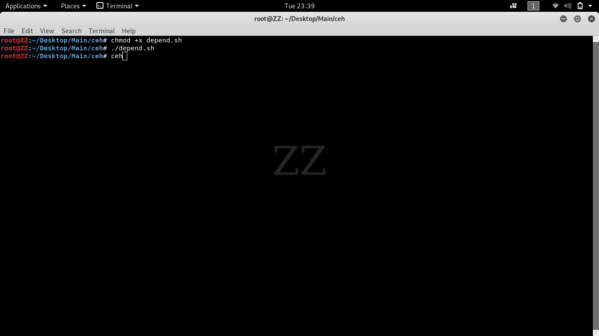
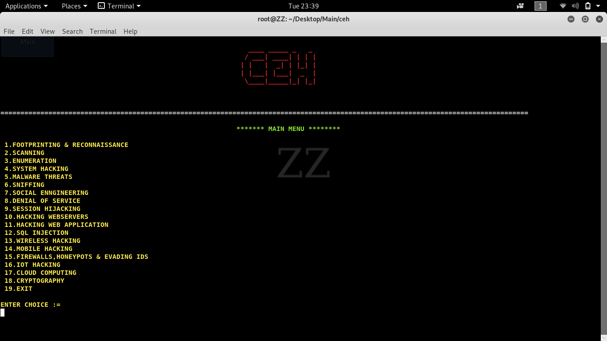

# CEH

securityhacpro@root:~# chmod +x depend.sh

securityhacpro@root:~# ./depend.sh

securityhacpro@root:~# ceh

First change mode of depend.sh file to make executable 
Second run the depend.sh file 
Third now everything is ready you can open over tool from anywhere(any directory) using ceh command.

About : 

Tool is for all those individual who wanted to learn about ceh(Certified Ethical Hacker) exam it has all 18 modules of exam with 
all the important information and links related to particular module and divided preinstalled kali linux tool according to every modules. Where you can learn about each tools and use it in two manner predefined way (for better understanding and easy way) and 
user defined way.

Use : 

Look for tools are installed or not if not it will automatically installed tool 

Interface of our tool with all modules of ceh

Thank you.

Project from securityhackpro team :)
