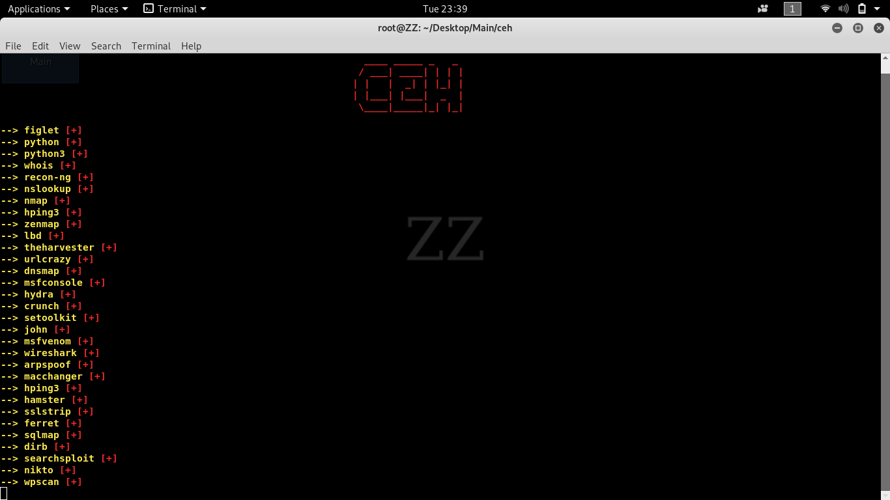
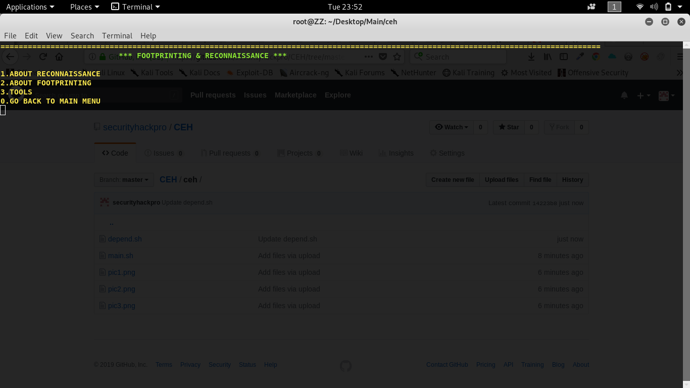
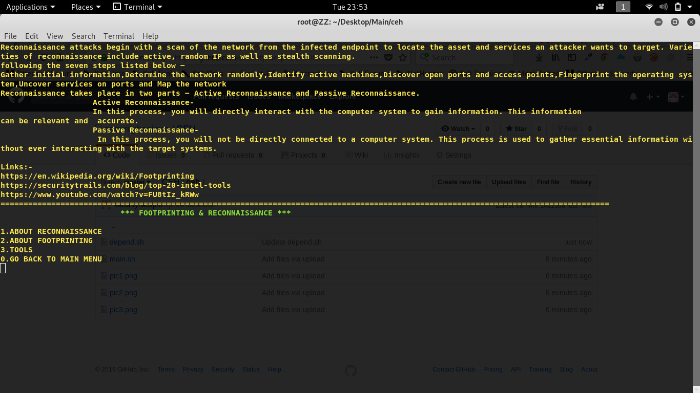
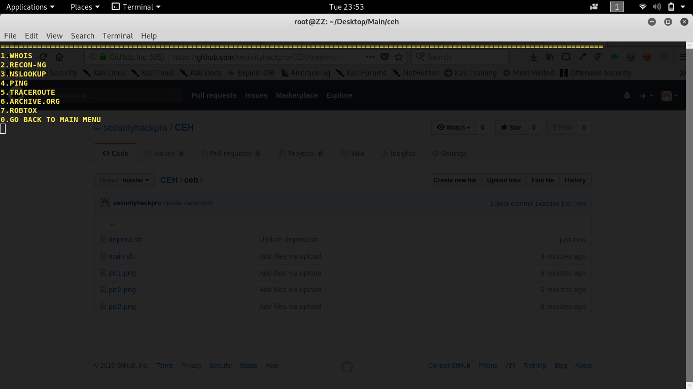
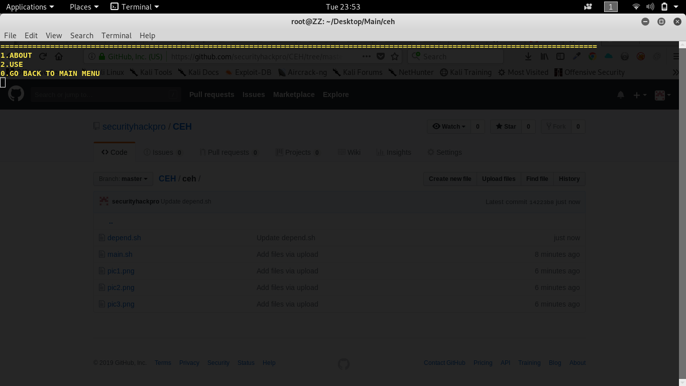
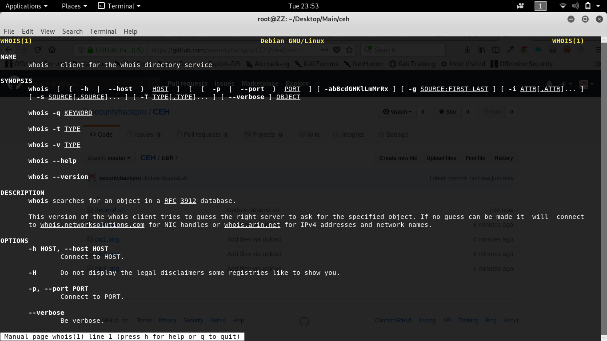
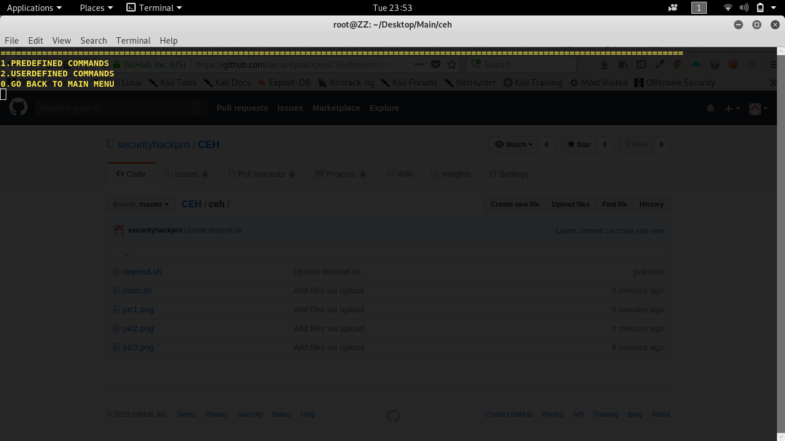
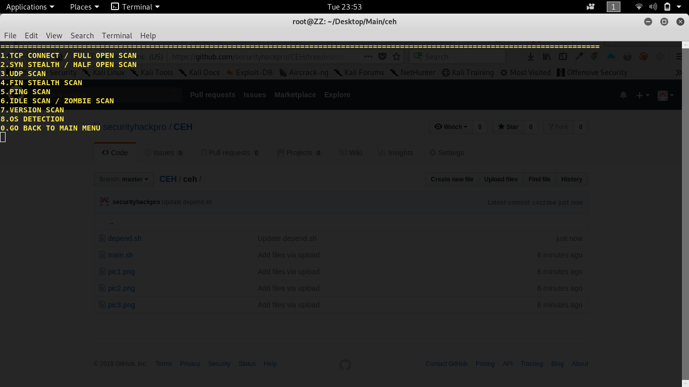
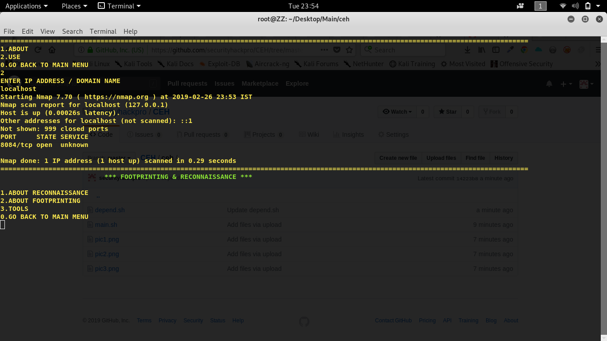

# CEH_TOOL

vaibhav@root:~# chmod +x depend.sh

vaibhav@root:~# ./depend.sh

vaibhav@root:~# ceh

First, change mode of depend.sh file to make it executable 

Second, run the depend.sh file 

Now everything is ready. You can open our tool from anywhere(any directory) using 'ceh' command.

About : 

This tool is for all those individuals who want to learn about CEH(Certified Ethical Hacker) exam. It has all 18 modules of the exam with all the important information and links related to particular module and preinstalled kali linux tool divided according to every module where you can learn about each tools and use it in two manners - predefined way (for better understanding and easy way) and user defined way.

Use : 

Look for tools that are installed or not. If not, it will automatically install the tool.

Interface of our tool with all the modules of CEH.

After selecting module of your choice you will get option to learn about that module and another option for tools of particular module. 

You will get some information about module and important links.

By selecting tool option you will get list of all the tools of that particular module.

After selecting the tool of your choice, you can learn about that tool or use it.

Some information about selected tool.

Two way of using tool predefined(more useful for newbies) or userdefined way.

In predefined way you will get some options like this(this is just an example for nmap tool. Similarly all other tools are also provided with user friendly options).

Thank you.

